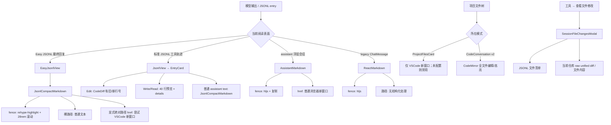

# 代码与文件渲染：从模型回复到可定位预览

> 范围：只分析消息中的代码、文件路径、文件预览和 Diff 呈现；不重述 Home、Rail、Settings 或工具抽屉的通用纪律。本文是后续实现规格，不代表本轮修改了前端。源码行号以 2026-08-28 工作区快照为准。

## 0. 结论先行

1. **CodexMonitor 的强项是文件引用，不是消息代码高亮。** 普通文本路径和行内代码路径会被规范成 `message-file-link`，保留行/列并按工作区缩短显示；但消息 fence 只保留 `language-*` class、显示语言名和复制按钮，没有接入 Prism/rehype 的 token 高亮（`examples/CodexMonitor/src/features/messages/components/Markdown.tsx:352-403,580-600,611-643`）。Prism 真正用在文件预览与 Diff fallback（`examples/CodexMonitor/src/utils/syntax.ts:1-81`）。
2. **Mobius 的强项与缺口正好相反。** Markdown fence 已通过 `rehype-highlight` 产生 `hljs-*` token，部分表面还有复制、行号和长内容折叠（`mobius/frontend/src/services/markdown.ts:1-13`；`mobius/frontend/src/components/assistant-chat.tsx:270-320`；`mobius/frontend/src/components/viewer/text-preview.tsx:11-46`）；但普通路径不会自动变成对象，显式绝对路径链接也只能尝试 VSCode，新窗口失败时没有原位反馈（`mobius/frontend/src/components/jsonl-compact-markdown.tsx:6-16,58-73`）。
3. **后续不应重造 IDE。** Mobius 已有受权限约束的单文件读取 API、CodeMirror 和会话 Diff Modal（`mobius/backend/routes/projects.ts:3259-3288`；`mobius/frontend/src/components/workspace/code-conversation-pane.tsx:372-403,1107-1159`；`mobius/frontend/src/components/chat.tsx:699-898`）。应该补一条统一的“解析目标 → 内部预览/定位 → 可选外部打开”链路，并保留 JSONL 工具轨迹。

## 1. CodexMonitor：消息里的文件引用如何生成

### 1.1 识别管线

```text
Markdown 源文本
  ├─ 普通 text 节点 ── remarkFileLinks ── codex-file:<encoded target>
  ├─ inlineCode 节点 ── React code renderer 再单独 parse
  ├─ 显式 Markdown href ── file:// / 本地路径启发式解析 ── 普通 anchor + 文件点击语义
  └─ fenced code ── 明确跳过路径 linkify
                    ↓
             ParsedFileLocation
             { path, line, column }
                    ↓
        describeFileTarget(workspacePath)
                    ↓
  裸文本 / inlineCode / codex-file：<a class="message-file-link">
     file name · Lline[:column] · optional parent
```

关键点如下。

- `remarkFileLinks` 只遍历普通文本；已经位于 link、inlineCode、code 的节点被跳过，避免嵌套链接和把 fence 内容误判为路径（`examples/CodexMonitor/src/features/messages/utils/messageFileLinks.ts:257-259,434-460`）。行内代码由 `Markdown` 的 `code` renderer 再调用 `parseInlineFileTarget`，因此 `` `src/a.ts:12` `` 仍会变成 chip（`examples/CodexMonitor/src/features/messages/components/Markdown.tsx:580-600`）。
- 普通文本匹配 POSIX/`~/`/`./`/`../`/含斜杠相对路径、Windows drive path 和 UNC path；路径后可带行位置后缀（`examples/CodexMonitor/src/features/messages/utils/messageFileLinks.ts:31-43`）。相对候选必须足够像文件：例如末段含扩展名；自然语言 `app/daemon behavior` 不会被链接（`messageFileLinks.ts:197-232`；测试 `remarkFileLinks > does not turn natural-language slash phrases into file links`）。
- 明确排除 HTTP、mail、thread route、hash anchor 和已知本地工作区路由；`/workspace/settings#L12` 不会被误当文件（`messageFileLinks.ts:294-355`；测试 `remarkFileLinks > keeps workspace route anchors out of linkification`）。
- 显式 Markdown href 比裸文本更宽容：`file://`、Windows/UNC、带行号的绝对/相对路径以及足够深、带文件名的路径可解析；URL 会先安全解码，再保留结构化行列（`messageFileLinks.ts:294-355,467-500`）。但这一分支渲染的是保留原 children 的普通 `<a>`，只是点击走 file opener，不会自动套 `message-file-link` chip（`Markdown.tsx:532-549`）。

### 1.2 行号、列号与范围

内部目标统一为 `{ path, line, column }`（`examples/CodexMonitor/src/utils/fileLinks.ts:1-5`），接受：

| 输入 | 结构化结果 | 说明 |
| --- | --- | --- |
| `src/a.ts:42` | line 42 | 冒号行号 |
| `src/a.ts:42:7` | line 42, column 7 | 冒号行列 |
| `src/a.ts#L42C7` | line 42, column 7 | GitHub 风格 anchor |
| `src/a.ts:12-30` | line 12 | 当前只保留范围起点 |
| `file:///repo/a.ts#L42` | line 42 | file URL 单独解析并解码 |

解析顺序和范围降级见 `examples/CodexMonitor/src/utils/fileLinks.ts:118-163`。行为由测试 `useFileLinkOpener > preserves file link line and column metadata for editor opens`、`parses #L line anchors before opening the editor`、`normalizes line ranges to the starting line before opening the editor` 固化（`useFileLinkOpener.test.tsx:173-251`）。所以 CodexMonitor 能“跳到范围起点”，但**没有保留 endLine**，不能称为完整范围契约。

### 1.3 相对路径、绝对路径与工作区

- 显示层：`describeFileTarget` 先用 `relativeDisplayPath` 把工作区内绝对路径缩为相对路径，再拆出文件名、父路径、`Lline[:column]`；完整值放在 title（`messageFileLinks.ts:502-524`；`Markdown.tsx:319-349`）。
- 打开层：`resolveFilePath` 优先把容器式 `/workspace/...`、`/workspaces/...` 映射到活动工作区；真实绝对路径原样保留；普通相对路径拼到 `workspacePath`（`examples/CodexMonitor/src/features/messages/hooks/useFileLinkOpener.ts:65-78`）。
- 这些不是注释承诺：测试 `maps /workspace root-relative paths to the active workspace path`、`maps /workspace/<workspace-name>/...`、`maps nested /workspaces/...` 覆盖了三种映射（`useFileLinkOpener.test.tsx:111-171`）。

对裸文本、inline code 和 `codex-file:`，最终样式不是普通蓝色下划线，而是带边框/底色的 inline-flex chip：文件名使用代码字体，行号为独立圆角 pill，父路径可省略号截断（`examples/CodexMonitor/src/styles/messages.css:1146-1195`）。显式 Markdown 文件 href 仍是普通 anchor；两者点击语义相同，默认可发现性并不完全相同。

## 2. CodexMonitor：代码 fence 与文件预览不是同一个渲染器

### 2.1 消息 fence

多行 fence 的头部显示语言名或 `Code`，提供复制按钮；默认复制带 fence 的内容，配置 modifier 时可复制裸内容（`examples/CodexMonitor/src/features/messages/components/Markdown.tsx:352-403`）。单行 fence 不显示头部，URL-only fence 会改成链接列表（`Markdown.tsx:405-429`）。CSS 给多行代码固定容器和水平滚动（`examples/CodexMonitor/src/styles/messages.css:1198-1257`）。

但 `ReactMarkdown` 只注册 `[remarkGfm, remarkFileLinks]`，没有 `rehype-highlight` 或 Prism renderer；`<code className={className}>` 只保留语言 class（`Markdown.tsx:398-400,611-643`）。因此：

- 有语言标签；
- 有复制；
- 有横向滚动；
- **没有消息级 token 语法着色、行号或长块折叠**。

这个事实很重要：Mobius 不应为了“像 CodexMonitor”而倒退掉自己已有的 hljs。

### 2.2 文件树预览 popover

内置预览从 Files panel 的文件行进入，不从消息 chip 进入。文件行点击计算一个固定定位的 640px popover，再调用 `readWorkspaceFile`；返回 `content` 与 `truncated`，错误留在 popover（`examples/CodexMonitor/src/features/files/components/FileTreePanel.tsx:351-415,583-600,766-802`）。

预览内容：

- 由扩展名映射语言，Prism 支持 bash/C/C++/CSS/Go/Java/JS/JSON/JSX/Kotlin/Markdown/Python/Ruby/Rust/SCSS/Swift/TOML/TS/TSX/YAML 等（`examples/CodexMonitor/src/utils/syntax.ts:1-51,60-81`）；
- 语言只用于逐行 token 高亮，popover header 显示 path 和可选 `Truncated`，**没有语言 badge**（`examples/CodexMonitor/src/features/files/components/FilePreviewPopover.tsx:65-89`）；
- 将服务端返回的**全部可用内容**按行拆分、逐行高亮并显示从 1 开始的行号；不是仅显示一个指定片段（`examples/CodexMonitor/src/features/files/components/FilePreviewPopover.tsx:61-80,170-199`）；
- 服务端若截断，只在标题显示 `Truncated`，不会伪装成完整文件（`FilePreviewPopover.tsx:82-100`）；
- body 最大约 70vh，代码区双向滚动；文件树计算位置时估算 640×520（`examples/CodexMonitor/src/styles/file-tree.css:244-265,331-345`；`FileTreePanel.tsx:351-375`）；
- 单击、Shift+click 或拖动可选择行范围；`Add to chat` 生成 `path:Lstart-Lend` 加 fenced snippet，随后关闭预览（`FileTreePanel.tsx:451-541`；测试 `FilePreviewPopover > wires drag selection mouse events to line handlers`）。

这里还有一个参考实现自身的断口：预览写回的是 `path:L12-L30`（`FileTreePanel.tsx:538-540`），而消息 parser 接受的是 `:12-30` 或单行 `#L12C3`，不接受 `:L12-L30`/`#L12-L30`（`examples/CodexMonitor/src/utils/fileLinks.ts:7-13,118-163`）。因此 Mobius 应学“选择后引用”，但要先定义可 round-trip 的统一范围语法。

所以 CodexMonitor 已有一个不错的“全文件/选择片段”渲染器，但消息路径点击和它没有接通：消息 chip 默认调用外部编辑器 opener（`useFileLinkOpener.ts:121-175`）。这是可学组件，不是可照抄的默认动作。

## 3. Mobius：同一类内容被多条渲染链分别处理

### 3.1 “回复里出现路径或代码时，用户看到什么”



### 3.2 Markdown 与 JSONL 回复

- 全局 Markdown 配置已经启用 GFM、数学公式、KaTeX 和 `rehype-highlight`（`mobius/frontend/src/services/markdown.ts:1-13`）。`.prose-chat` 与 `.jsonl-compact-md` 都有 `hljs-*` token 色（`mobius/frontend/src/index.css:5513-5595,5597-5651`）。
- Easy 最终回复经过 `JsonlCompactMarkdown`；它只定制 anchor、table、image，没有定制 pre/code 头部，所以有语法色和 28rem 最大高度滚动，但没有语言标题、复制或行号（`mobius/frontend/src/components/jsonl-compact-markdown.tsx:58-73`；`mobius/frontend/src/index.css:5597-5613`）。
- `AssistantMarkdown` 另写了一套 `CodePre`，提供复制按钮和 clipboard fallback（`mobius/frontend/src/components/assistant-chat.tsx:270-320`）；legacy `ChatMessage` 直接用 ReactMarkdown，只有 hljs，没有这套复制头（`mobius/frontend/src/components/chat.tsx:1447-1475`）。同一份 Markdown 因宿主不同产生不同能力。
- Easy 活动把文件修改压成字符串 `path · +x -y`，展开后用 `<li>` 输出，没有链接或 Diff 入口（`mobius/frontend/src/components/easy-jsonl/easy-jsonl-model.ts:189-213,228-258`；`EasyJsonlView.tsx:57-96`）。它保留了执行摘要，但丢掉了“文件对象”语义。

### 3.3 VSCode 链接

`JsonlCompactMarkdown` 只拦截**已经写成 Markdown anchor**的 href；裸路径不会经过 `MarkdownAnchor`（`mobius/frontend/src/components/jsonl-compact-markdown.tsx:6-16,58-73`）。拦截启发式又只接受 `/home/`、`/root/`、`/Users/`、`/tmp/`、`/var/`、`/mnt/`、`/opt/`、`/srv/`、`/data/` 开头的 POSIX 绝对路径，不接受相对路径、Windows、UNC 或 `file://`（`mobius/frontend/src/components/jsonl-vscode-link.tsx:110-120`）。

Provider 从 `/api/projects/:id/files?path=/` 取 bind path 与 VSCode URL；meta 未就绪时点击返回 null，让浏览器执行默认链接；没配 bind path/VSCode 时同样返回 null（`jsonl-vscode-link.tsx:58-104`）。`buildVscodeUrl` 在生成 payload 前主动剥掉 `:line[:column]`，注释也说明 code-server payload 不解析行号（`mobius/frontend/src/components/project-files.tsx:101-130`）。结果是“文件可能打开，但行号必丢”。

项目文件卡对这个限制更诚实：未配置 VSCode 时显示警告，文件按钮被禁用；配置后点击总是新窗口（`project-files.tsx:816-825,879-928,1252-1268`）。消息 href 则没有相同的原位失败态。

### 3.4 JSONL 工具卡片

标准 JSONL 没有丢掉工具轨迹。`EntryCard` 根据 Edit/Write/Bash/Read 选择专用 renderer，并保留折叠/展开（`mobius/frontend/src/components/viewer/EntryCard.tsx:201-215,257-309,449-475`）。具体能力：

- Edit `CodeDiff` 能从字符串 diff 或 unified hunk 计算真实 old/new line，显示增删色与双行号；但文件头是 span，代码只是 plain `<code>`，不可点、不可复制、无语法 token（`mobius/frontend/src/components/viewer/CodeDiff.tsx:13-70,73-140`）。
- Write 显示 basename、完整路径、行数；前 40 行直出，剩余 `<details>` 折叠（`mobius/frontend/src/components/viewer/WritePreview.tsx:11-45`；阈值在 `viewer/text-preview.tsx:11-46`）。
- Read 显示路径、offset/limit、读取结果起始行与总行数，支持复制路径/内容；文件名仍不可打开（`mobius/frontend/src/components/viewer/ReadCards.tsx:34-85,89-140`）。
- JSONL 虚拟列表能定位的是 `data-jsonl-line-no` 对应的**转录条目**，不是源代码行（`mobius/frontend/src/components/jsonl-virtual-list.tsx:192-237`）。不能把已有的“跳 JSONL 第 N 条”误当作“跳文件第 N 行”。

### 3.5 项目文件、CodeMirror 与会话文件 Modal

- CodeConversation v2 已有左文件树和中 CodeMirror，读取 `/api/projects/:id/file`，具备语言高亮、搜索、编辑等能力（`mobius/frontend/src/components/workspace/code-conversation-pane.tsx:30-44,372-403`）。但 `CodeMirrorEditorProps` 没有 initial line/selection，宿主调用也没传行位置（`mobius/frontend/src/components/workspace/code-mirror-editor.tsx:11-20,78-119`；`code-conversation-pane.tsx:1149-1156`）。所以它不是现成的 `path:line` 目标层。
- 单文件 API 有 readable-project 权限、路径穿越防护、1.5MB 截断和二进制判断，足以支撑只读预览（`mobius/backend/routes/projects.ts:3259-3288`）。无需为了 P0 另建文件传输协议。
- `SessionFileChangesModal` 左侧文件来自当前 session JSONL，右侧 diff 来自当前 Git 仓库，并在 UI 明说二者时间语义不同（`mobius/frontend/src/components/chat.tsx:699-769,804-808`）。它能显示 raw diff 或 fallback 文件内容，但 `GitDiffBlock` 的“行号”只是 raw diff 文本数组下标 `index + 1`，不是 old/new 源码行（`chat.tsx:673-697,848-893`）。

## 4. 对照表

| 能力 | CodexMonitor | Mobius 现在 | 判断 |
| --- | --- | --- | --- |
| 消息 fence 语法高亮 | 无 token 高亮；仅语言 class/标签（`Markdown.tsx:352-403,611-643`） | hljs 已启用（`services/markdown.ts:1-13`） | Mobius 保留，不能降级 |
| fence 行号 | 无 | 普通 Markdown 无；Read/Write/Diff 工具卡有 | 统一预览层才显示文件行号，普通 snippet 不强加 |
| 长块折叠 | 消息 fence 不折叠，仅横滚 | JSONL Markdown 限高滚动；Write/Read 40 行后折叠（`text-preview.tsx:11-46`） | Mobius 已部分更好，但规则不一致 |
| 复制 | 多行消息 fence 有 | AssistantMarkdown、Read 有；Easy fence/CodeDiff/Write 不一致 | 抽共享 code header |
| 路径 chip | 裸文本、inline code、`codex-file:` 是 chip；明确文件 href 可点但仍是普通 anchor | 基本没有；Easy 活动是纯字符串 | **P0 必补，并统一显式 href 样式** |
| 路径行/列 | `:line[:col]`、`#LxCy`；范围降级起点 | VSCode 打开剥掉 `:line`；无结构化 target | **P0 必补 endLine 契约** |
| 内部预览 | 文件树 popover，全可用内容、行号、Prism、截断标记 | CodeConversation 可看全文件，但回复路径不接入；Modal 只看变更文件 | **P0 先做只读层，P1 统一** |
| 打开编辑器 | 消息 chip 默认外部 app | 显式绝对 href + VSCode 配置才可能打开；项目树另有入口 | 外部打开只做增强 |
| Diff 可点 | Git 文件列表可点进中心 diff；viewer 文件头/hunk 本身不可点 | Modal 左文件可点；JSONL CodeDiff 文件头/hunk 不可点 | 建统一 artifact target，不夸大参考实现 |
| 失败态 | 消息外部打开失败为全局 toast；文件预览错误在 popover | project tree 有警告；消息 href 首次/未配置可落入浏览器默认行为 | 回复链必须原位报错并保留目标 |

## 5. Mobius 具体差在哪里

以下不是泛泛的“体验不好”，而是源码链路断点。

1. **裸路径永远只是字。** 全局 Markdown 只有 GFM/Math，没有 file-link remark plugin（`mobius/frontend/src/services/markdown.ts:1-13`）；`JsonlCompactMarkdown` 仅处理已存在的 `<a>`（`jsonl-compact-markdown.tsx:6-16,58-73`）。模型常见的 `src/foo.ts:42` 不可发现、不可操作。
2. **路径识别覆盖面过窄。** `isLikelyFilesystemPath` 只认少数 POSIX 根前缀（`jsonl-vscode-link.tsx:110-120`），相对路径、Windows、UNC、`file://`、扩展名缺失文件均落空；CodexMonitor 对这些有明确 parser 与防误判测试（`messageFileLinks.ts:31-66,197-232`）。
3. **行号在打开前被主动删除。** `stripLineColSuffix` 把 `:line[:col]` 从路径移除，生成的 code-server payload 不携带替代行位置（`mobius/frontend/src/components/project-files.tsx:101-130`）；`#L12-L30` 又没有 parser。结果不是“偶尔定位不准”，而是契约中根本没有 line/endLine。
4. **第一次点击可能走错层。** project meta 未完成时 `openLocalPath` 返回 null，anchor 不 `preventDefault`，浏览器会把本地路径当普通新窗口链接（`jsonl-vscode-link.tsx:90-104`；`jsonl-compact-markdown.tsx:8-15`）。失败没有留在消息旁，也没有“预览/重试”。
5. **同一代码块在不同对话表面能力不同。** `AssistantMarkdown` 有复制按钮（`assistant-chat.tsx:270-320`），Easy JSONL 的 `JsonlCompactMarkdown` 没有 pre renderer（`jsonl-compact-markdown.tsx:58-73`），legacy Chat 又直接渲染 ReactMarkdown（`chat.tsx:1447-1475`）。用户无法形成稳定预期。
6. **Easy 摘要把可操作文件降成文本。** `filePath · +x -y` 在 model 层被拼成 string，view 层用 `<li>` 输出（`easy-jsonl-model.ts:189-213`；`EasyJsonlView.tsx:78-84`）；不能从“修改了 3 个文件”直接看对应 Diff。
7. **工具 Diff 有真实行号，Modal Diff 却显示 raw 文本序号。** `viewer/CodeDiff.tsx:32-70` 会解析 hunk 的 old/new line；`chat.tsx:683-695` 只显示 `index + 1`。同一产品内“行号”语义冲突，且两边文件头都不产出点击目标（`CodeDiff.tsx:121-140`；`chat.tsx:855-888`）。
8. **已有内部编辑器没有深链输入。** `CodeMirrorEditorProps` 只有 fileName/value/skin/onChange/wrap（`workspace/code-mirror-editor.tsx:11-20`），所以即使从消息导航到 CodeConversation，也不能把 `:42` 交给它。
9. **VSCode 成了消息文件的唯一路径，却不是可靠路径。** ProjectFilesCard 在未配置 VSCode 时直接禁用文件按钮并提示（`project-files.tsx:879-928,1252-1268`）；消息里既无内部 fallback，也无同等提示。内部只读预览本应是默认，编辑器打开才是增强。
10. **“全文件”和“本次片段”没有共同对象模型。** Write/Read 卡知道文件路径与起始行（`WritePreview.tsx:18-40`；`ReadCards.tsx:89-134`），会话 Modal 知道变更文件，CodeConversation 知道全文件；它们没有共享 `{path,line,endLine,source,intent}`，因此无法互跳。

## 6. 取舍：必须学 / 可学 / 不要学

| 级别 | 内容 |
| --- | --- |
| **必须学** | 结构化文件目标；对相对/绝对/容器路径的工作区解析；明确显示行位置；内部预览保留会话；截断与失败就地呈现；文件选择片段可引用回 Composer |
| **可学** | `message-file-link` 的 chip 形态；640px popover 在宽屏的轻量感；按扩展名逐行高亮；外部 app 菜单作为二级动作 |
| **不要学** | 消息路径默认直接跳外部编辑器；范围只保留起点；消息 fence 无语法色；把 Files/Git/Plan 固定成 CodexMonitor 右栏；引入 stage/revert/commit/push/PR 写工作流 |

Mobius 的目标不是把回复变成 IDE，而是让回复里的“文件证据”从纯文本升级为可验证对象。JSONL 执行轨迹继续保留；统一的是目标和查看层，不是删掉现有卡片。
